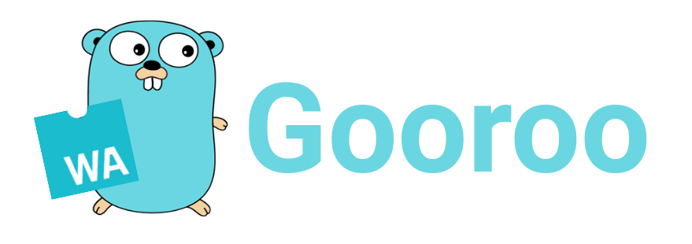

 <h1>A web frontend library in Go ( WebAssembly ) </h1>
 
  <h2> Dare to imagine web development without JavaScript </h2>

## Contents

## Why Gooroo ?

The Gooroo library gathers a set of cumulative functions allowing you
to create web applications on the Frontend side. To do this purpose, 
it implements DOM manipulation features based on syscall/js and webassembly.
Its objective is to explore the possibilities of a modern, lightweight and
javascript independent web library.

> Its functional implementation is based on many React concepts.

## Html with variadics

## Conditions & Loops

## Params

### Generic Params

### Binding Params

### Layout Params

## Use hooks !