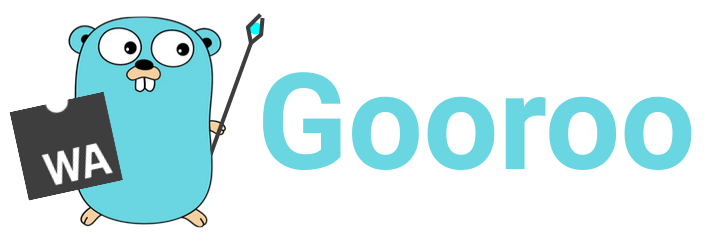

<div style="text-align: center">
 <h1>A web frontend library in Go ( WebAssembly ) </h1>
 
  <h2> Dare to imagine web development without JavaScript </h2>
  <a href="https://pkg.go.dev/github.com/Matbabs/Gooroo"></a>
</div>

## Why Gooroo ?

The Gooroo library gathers a set of cumulative functions allowing you
to create web applications on the Frontend side. To do this purpose,
it implements DOM manipulation features based on syscall/js and webassembly.
Its objective is to explore the possibilities of a modern, lightweight and
javascript independent web library.

> Its functional implementation is based on many React concepts.

## Html with variadics - DomComponent

### Main App Component

```go
import (
	o "github.com/Matbabs/Gooroo"
)

func App() o.DomComponent {

	return o.Div(
		o.H1("Hello World !"),
		o.Div(
			o.P("This is a paragraph ..."),
			o.Ul(
				o.Li(o.Span("Item 1")),
				o.Li(o.Span("Item 2")),
				o.Li(o.Span("Item 3")),
			),
		),
	)
}
```

Here you can see the main component of the application.
It is a function that returns a DomComponent.

Most of the DomComponents can have a set of children (as in classical HTML), thanks to the variadic parameter passing.

> example of DomComponent: `o.H1`, `o.P`, `o.Span`, `o.Table`, `o.Form`, `o.Input`, `o.Button` ...

### Integration with your own components

```go
func App() o.DomComponent {

	p := "This is a prop"

	return o.Div(
		o.H1("Hello World !"),
		o.Div(
			o.P("This is a paragraph ..."),
			component.OtherComponent(p),
		),
	)
}
```

app.go

```go
func OtherComponent(prop string) o.DomComponent {

	return o.Div(
		o.H1("An other Component !"),
		o.P("This is another paragraph"),
		o.Span(prop),
	)
}
```

other.go

As in most frontend libraries, Gooroo implements a component system that you can integrate with each other.

> Also observe the way in which one or more `props` can be propagated.

### Addition of a CSS style sheet

```css
* {
  color: crimson;
}
```

master.css

```go
func App() o.DomComponent {

	o.Css("master.css")

	return o.Div(
		o.H1("Hello World !"),
		o.Div(
			o.P("This is a paragraph ..."),
			o.Ul(
				o.Li(o.Span("Item 1")),
				o.Li(o.Span("Item 2")),
				o.Li(o.Span("Item 3")),
			),
		),
	)
}
```

app.go

You can use `o.Css()` to integrate your CSS codes.

## Conditions & Loops

### If - Boolean Condition with o.If

```go
func App() o.DomComponent {

	isTrue := true

	return o.Div(
		o.If(isTrue,
			o.P("This text will be displayed"),
		),
		o.If(!isTrue,
			o.P("This one will be not"),
		),
	)
}
```

Using the DomElemt `o.If` allows to define the appearance of the elements if the condition passed in parameter is valid.

### For - Loop Condition with o.For

```go
func App() o.DomComponent {

	arr := []string{"Cat", "Dog", "Bird"}

	return o.Div(
		o.For(arr, func(i int) o.DomComponent {
			return o.P(arr[i])
		}),
	)
}
```

Using the DomElemt `o.For` allows to define the appearance of the elements of an array using a `func(i int) o.DomComponent`, where `i` represents the position of the element in the array.

## DomComponent Params

### General Params

```go
func App() o.DomComponent {

	return o.Div(o.Style("padding: 40px; color: lightblue"),
		o.H1("Hello World !"),
		o.Div(o.ClassName("container"),
			o.Img(o.Style("height: 150px;"), o.Src("https://go.dev/images/gophers/biplane.svg")),
			o.Div(
				o.A("A link to official Go WebSite", o.Id("go-link"), o.Href("https://go.dev/")),
			),
		),
	)
}
```

A set of HTML attributes can be hooked through DomComponent.

Here is a non-exhaustive list:

- `o.ClassName`
- `o.Style`
- `o.Src`
- `o.Href`
- `o.Value`
- `o.Id`
- `o.Type`
- `o.Placeholder`
- `o.Title`

### Binding Params

```go
func App() o.DomComponent {

	handleClick := func(e js.Value) {
		fmt.Println("Click detected !")
	}

	return o.Div(
		o.Button("Click here", o.OnClick(handleClick)),
	)
}
```

The DomComponent `o.OnClick` is a parameter that defines the execution of a callback function `func (e js.Value)` where `e` is the JavaScript event.

> For example you can use `e.Get("type")` to recover type of the event.

```go
func App() o.DomComponent {

	var input any

	handleChange := func(e js.Value) {
		// look for
		fmt.Println(e.Get("target").Get("value"))
		// same as
		fmt.Println(input)
	}

	return o.Div(
		o.Input(o.OnChange(&input, handleChange)),
	)
}
```

The DomComponent `o.OnChange` is a parameter that defines the execution of a callback function `func (e js.Value)` where `e` is the JavaScript event, as well as the update of the value of the pointer passed in parameter.

> For example you can use `e.Get("target").Get("value")` to recover value of the event, but also read pointer `input`.

### Layout Params

Gooroo integrates DomComponent Param responsible for the layout of the elements.

```go
func App() o.DomComponent {

	return o.Div(o.GridLayout(3, 0, "20px"),
		o.Div(
			o.Span("Column 1"),
		),
		o.Div(
			o.Span("Column 2"),
		),
		o.Div(
			o.Span("Column 3"),
		),
	)
}
```

Use `o.GridLauout` to define a grid.

```go
func App() o.DomComponent {

	return o.Div(o.FlexLayout("column wrap", "center", "center", "20px"),
		o.Div(
			o.Span("Row 1"),
		),
		o.Div(
			o.Span("Row 2"),
		),
		o.Div(
			o.Span("Row 3"),
		),
	)
}
```

Use `o.FlexLayout` to define a flex area.

## Use hooks !

### UseState - manage the app state

```go
func App() o.DomComponent {

	input, setInput := o.UseState("initial value")

	handleClick := func(e js.Value) {
		setInput(*input)
	}

	return o.Div(
		o.Input(o.OnChange(input)),
		o.Button("Set value", o.OnClick(handleClick)),
		o.P((*input).(string)),
	)
}
```

`o.UseState` (as in React.JS) allows to register a variable in the application state.

It returns a `pointer` to this variable (allowing to access its value) and a `setter function`.

**Once the function is called, the state of the application is updated and the rendering is done again.**

### UseEffect - control of edge effects

```go
func App() o.DomComponent {

	A, setA := o.UseState("A")
	B, setB := o.UseState("B")

	o.UseEffect(func() {
		fmt.Println("Always !")
	})

	o.UseEffect(func() {
		fmt.Println("When A changed !")
	}, A)

	o.UseEffect(func() {
		fmt.Println("When B changed !")
	}, B)

	o.UseEffect(func() {
		fmt.Println("When A or B changed !")
	}, A, B)

	handleClickA := func(e js.Value) {
		setA(*A)
	}

	handleClickB := func(e js.Value) {
		setB(*B)
	}

	return o.Div(o.GridLayout(2, 0, "20px"),
		o.Input(o.OnChange(A)),
		o.Input(o.OnChange(B)),
		o.Button("Set A", o.OnClick(handleClickA)),
		o.Button("Set B", o.OnClick(handleClickB)),
		o.P((*A).(string)),
		o.P((*B).(string)),
	)
}
```

`o.UseEffect` allows to trigger a function when rendering the component.

> At each state change and thus new rendering, the o.UseEffect is triggered according to its dependency list:
>
> - if no state variable, the call is always made
> - if one or more variables, the call is made when one of them changes

### UseMemo - optimize expensive calculations

```go
func App() o.DomComponent {

	A, setA := o.UseState("A")

	memoizedValue := o.UseMemo(func() any {
		expensiveCalculation := 1 + 1
		return expensiveCalculation
	}, A)

	handleClickA := func(e js.Value) {
		setA(*A)
	}

	return o.Div(o.GridLayout(2, 0, "20px"),
		o.Input(o.OnChange(A)),
		o.Button("Set A", o.OnClick(handleClickA)),
		o.P((*A).(string)),
		o.P(memoizedValue.(int)),
	)
}
```

`o.UseMemo` is used for expensive computations, it allows to return a `memoized value`. In the same way as `o.UseEffect`, the calculation is triggered according to its dependency list.

### UseCallback - optimize the creation of your lambda functions

```go
func App() o.DomComponent {

	A, setA := o.UseState("A")

	memoizedFunction := o.UseCallback(func(a ...any) any {
		fmt.Println("Memoized function is called !")
		fmt.Println(a[0])
		return a[0]
	}, A)

	handleClickA := func(e js.Value) {
		setA(*A)
	}

	return o.Div(o.GridLayout(2, 0, "20px"),
		o.Input(o.OnChange(A)),
		o.Button("Set A", o.OnClick(handleClickA)),
		o.P((*A).(string)),
		o.P((*memoizedFunction)("It's a parameter").(string)),
	)
}
```

`o.UseCallback` is used to avoid regenerating a lambda function, so it returns a pointer to a `memoized function`. In the same way as `o.UseEffect`, the regeneration is triggered according to its dependency list.


## Install

### Get "wasm_exec.js" for Golang Web Assembly

`cp "$(go env GOROOT)/misc/wasm/wasm_exec.js" .`

### Build Golang Web Assembly Project

`GOOS=js GOARCH=wasm go build -o ./main.wasm`

### Run HTML with Golang Web Assembly

```html
<html>
  <head>
    <title>Example Gooroo</title>
    <link rel="icon" type="image/x-icon" href="./favicon.ico" />
    <meta charset="utf-8" />
    <link rel="stylesheet" href="master.css" />
    <script src="wasm_exec.js"></script>
    <script>
      const go = new Go();
      WebAssembly.instantiateStreaming(
        fetch("main.wasm"),
        go.importObject
      ).then((result) => {
        go.run(result.instance);
      });
    </script>
  </head>
  <body></body>
</html>

```